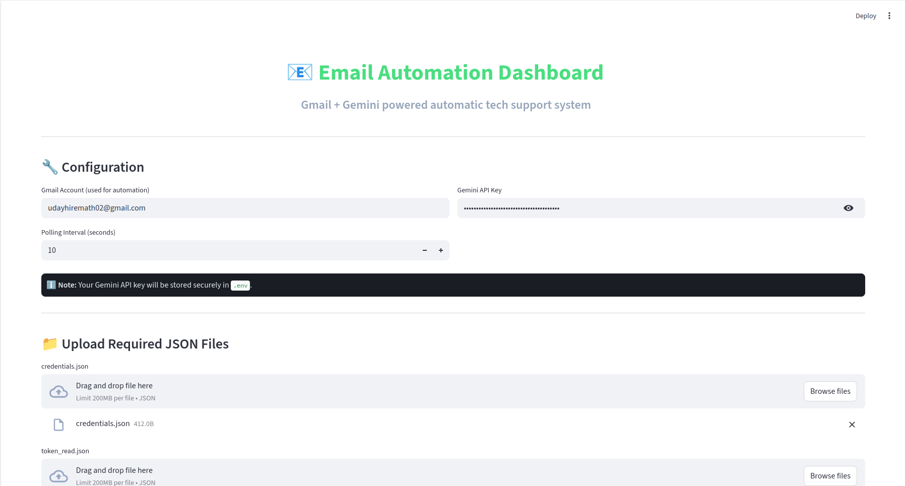
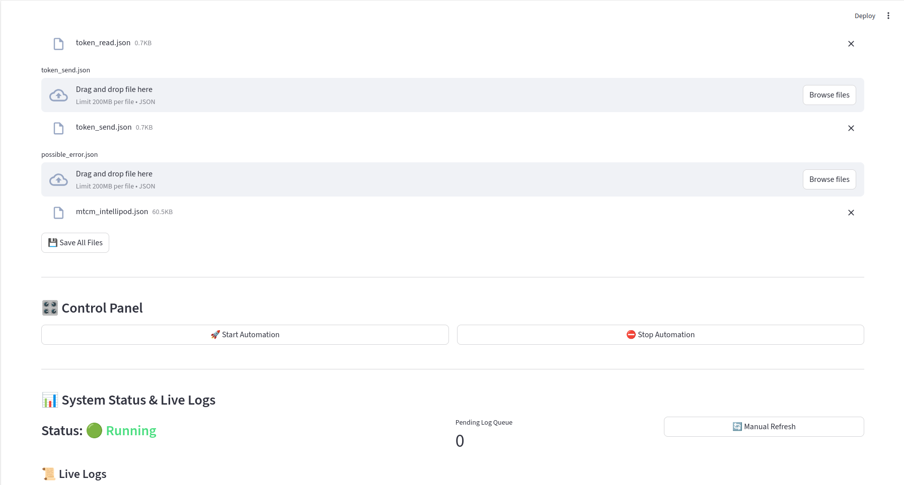
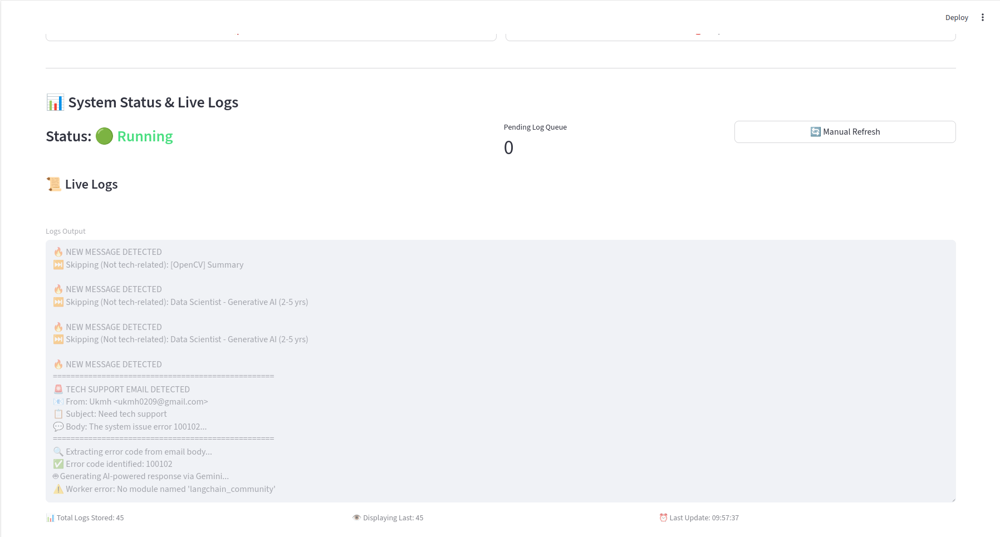
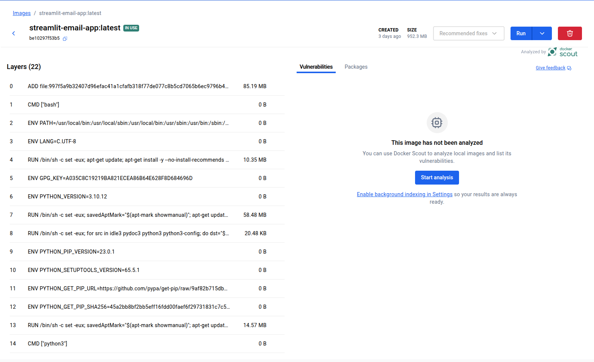

<h1 align="center">🚀 Gemini-Powered Email Automation – Docker + AWS Cloud</h1>

This project enables automated support email reply generation using <b>Gemini LLM</b> + Gmail API.
It includes a Streamlit interface, background email automation worker, and cloud deployment
through Docker + AWS EC2 + Amazon ECR.

<h2>🧩 Project Components</h2>

<ul>
<li><b>Streamlit UI (app.py)</b> – configuration, logging, automation controls.</li>
<li><b>Gmail worker (email_worker.py)</b> – background email reading & processing engine.</li>
<li><b>Gemini response builder (gemini_llm_response.py)</b> – generates email text using Gemini. :contentReference[oaicite:0]{index=0}</li>
<li><b>Email sender (email_generator.py)</b> – formats and sends emails via Gmail API. :contentReference[oaicite:1]{index=1}</li>
<li><b>Dockerfile</b> – containerization for cloud deployment.</li>
</ul>

<h2>📦 Functionality Flow Diagram</h2>

<pre align="center">
User → Streamlit UI → Gemini LLM → Reply Email Text
      ↑                 |
      |                 ↓
 Gmail Inbox → Worker → Email Sender → Customer
</pre>

<h2>📁 Credential Files Required for Gmail Integration</h2>

To securely access Gmail inbox and send messages, the application uses OAuth tokens.
These must be created manually once and uploaded into the app:

<h3>1️⃣ credentials.json</h3>

This file is downloaded from Google Cloud OAuth console. It contains:

<ul>
<li>client_id</li>
<li>client_secret</li>
<li>redirect_uris</li>
<li>project identifiers</li>
</ul>

Purpose:
<b>Used to generate read & send tokens</b> for Gmail API access.
Never upload this file publicly.

<h4>How to generate credentials.json:</h4>

<ol>
<li>Go to Google Cloud Console → Create a project</li>
<li>Enable Gmail API</li>
<li>Go to: Credentials → Create OAuth client</li>
<li>Select: Desktop App</li>
<li>Download JSON → rename to <code>credentials.json</code></li>
<li>Place inside the root folder of the project</li>
</ol>

<h3>2️⃣ token_read.json</h3>

The first time you run the app to authorize Gmail inbox reading, a login window opens.

This token stores permission:

<pre>https://www.googleapis.com/auth/gmail.readonly</pre>

Purpose:

<ul>
<li>Read unread emails</li>
<li>Fetch body, subject, sender</li>
<li>Avoid re-login authentication</li>
</ul>

Generated by:

<pre>email_worker.py</pre>

Verified here: <code>Credentials.from_authorized_user_file("token_read.json")</code> :contentReference[oaicite:2]{index=2}

<h3>3️⃣ token_send.json</h3>

Second OAuth authorization for email sending.

Scope stored:

<pre>https://www.googleapis.com/auth/gmail.send</pre>

Purpose:

<ul>
<li>Enable automated email replies</li>
<li>Store sending token so future logins are not required</li>
</ul>

Used inside Gmail send function through:

<pre>
service.users().messages().send(...)
</pre>

As seen in email sender file. :contentReference[oaicite:3]{index=3}

<h2>📌 Offline Token Workflow Recap</h2>

<ol>
<li>credentials.json → downloaded manually</li>
<li>token_read.json → auto created first time inbox read occurs</li>
<li>token_send.json → auto created first time send function executed</li>
</ol>

Once tokens exist, no further authentication interaction needed.

<h2>📦 Docker Containerization</h2>

This app is packaged into a Docker image that runs Streamlit + Gmail worker in isolation.

<h3>🔨 Build Docker image:</h3>

<pre>
docker build -t gemini-email-automation .
</pre>

<h3>▶️ Run locally:</h3>

<pre>
docker run -p 8501:8501 gemini-email-automation
</pre>

<h2>☁️ Deploy Container to AWS Cloud – Full Guide</h2>

<h3>Step 1 — Create AWS EC2 instance</h3>

<ul>
<li>Ubuntu 22 → 2GB RAM → open port: 8501</li>
<li>Install Docker + AWS CLI</li>
</ul>

<pre>
sudo apt update
sudo apt install docker.io awscli -y
</pre>

<h3>Step 2 — Create AWS ECR repository</h3>

<ol>
<li>Console → Amazon ECR → Create repository</li>
<li>Copy ECR URI (example below)</li>
</ol>

<pre>
<aws_id>.dkr.ecr.ap-south-1.amazonaws.com/gemini-email-automation
</pre>

<h3>Step 3 — Authenticate Docker to ECR</h3>

<pre>
aws ecr get-login-password --region ap-south-1 \
| docker login --username AWS \
--password-stdin <aws_id>.dkr.ecr.ap-south-1.amazonaws.com
</pre>

<h3>Step 4 — Tag image</h3>

<pre>
docker tag gemini-email-automation \
<aws_id>.dkr.ecr.ap-south-1.amazonaws.com/gemini-email-automation:latest
</pre>

<h3>Step 5 — Push to ECR</h3>

<pre>
docker push \
<aws_id>.dkr.ecr.ap-south-1.amazonaws.com/gemini-email-automation:latest
</pre>

<h3>Step 6 — Pull on EC2</h3>

<pre>
docker pull \
<aws_id>.dkr.ecr.ap-south-1.amazonaws.com/gemini-email-automation:latest
</pre>

<h3>Step 7 — Run container</h3>

<pre>
docker run -d -p 8501:8501 \
--name geminiapp \
<aws_id>.dkr.ecr.ap-south-1.amazonaws.com/gemini-email-automation:latest
</pre>

Final app URL:

<pre>
http://EC2-PUBLIC-IP:8501
</pre>

<h2 align="center">📸 Project Image Gallery</h2>

All screenshots and UI previews related to the application are shown below.
Place new files inside the <code>images/</code> folder and update filenames here.

<table align="center">
<tr>
    <td align="center" width="50%">
        
        
<b>Image 1</b>

    </td>
    <td align="center" width="50%">
        
        
<b>Image 2</b>

    </td>
</tr>

<tr>
    <td align="center" width="50%">
        
        
<b>Image 3</b>

    </td>
    <td align="center" width="50%">
        
        
<b>Image 4</b>

    </td>
</tr>

<tr>
    <td align="center" width="50%">
        
        
<b>Image 5</b>

    </td>
    <td align="center" width="50%">
        
        
<b>Image 6</b>

    </td>
</tr>
</table>

<i>⚠️ Add or remove table rows depending on number of images you upload.</i>

<h2 align="center">🎯 Final Result</h2>

Your system now automates Gmail reading → LLM reasoning → issue-based reply generation 
and runs securely on AWS cloud using Docker and Gemini AI — with zero manual operation required.

